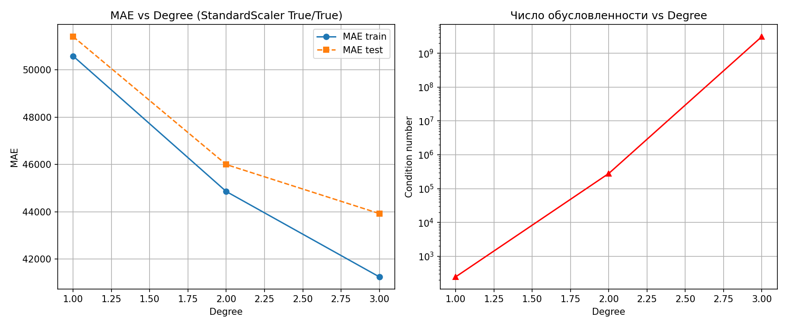

# Линейная регрессия и численная устойчивость МНК

Исследование того, как предобработка признаков влияет на точность линейной регрессии и на численную устойчивость решения методом наименьших квадратов. Датасет California Housing.

Расчётно-графическая работа по курсу «Численные методы алгебры», ИТМО, 2026.

## Задача

Линейная регрессия сводится к решению нормальной системы

$$X^T X \mathbf{w} = X^T \mathbf{y}.$$

Чувствительность весов к ошибкам округления определяется числом обусловленности $\mathrm{cond}(X^T X)$. В работе сравниваются шесть конфигураций пайплайна `StandardScaler → PolynomialFeatures → LinearRegression`: разные режимы масштабирования (`with_mean`, `with_std`) и степени полинома 1–3. Для каждой считаются MAE на train/test и число обусловленности.

## Результаты

Данные: 20 433 строки, 8 признаков, разбиение train/test 76/24.

| # | with_mean | with_std | degree | MAE train | MAE test | cond(XᵀX) |
|---|---|---|---|---|---|---|
| 1 | — | — | 1 | 50 585 | 51 409 | 8.85e+06 |
| 2 | ✓ | — | 1 | 50 585 | 51 409 | 2.37e+07 |
| 3 | — | ✓ | 1 | 50 585 | 51 409 | 2.38e+05 |
| 4 | ✓ | ✓ | 1 | 50 585 | 51 409 | 2.46e+02 |
| 5 | ✓ | ✓ | 2 | 44 855 | 45 996 | 2.80e+05 |
| 6 | ✓ | ✓ | 3 | 41 243 | 43 922 | 3.12e+09 |



**Основные выводы**

- **Масштабирование не меняет точность, но стабилизирует решение.** MAE одинакова во всех линейных конфигурациях, а полная стандартизация снижает число обусловленности с 8.85e+06 до 2.46e+02, более чем на 4 порядка. Одно лишь центрирование обусловленность даже ухудшает: проблему создают разные масштабы признаков, а не их средние.
- **Полиномиальные признаки дают выигрыш в качестве ценой устойчивости.** При степени 2–3 MAE на тесте снижается на 10–15%, а число обусловленности растёт до 3e+09. При решении нормальных уравнений в double это означает потерю 9–10 значащих цифр из ~16.
- **Переобучение начинается, но пока не катастрофическое.** Разрыв между train и test растёт с 824 до 2 679, и всё же при 15.5 тыс. обучающих строк степень 3 остаётся лучшей на тесте.
- **Практический компромисс:** стандартизация + `degree=2` или `degree=3` с регуляризацией (Ridge).

## Структура

```
linear_regression.ipynb   теория, код эксперимента, анализ
housing.csv               данные California Housing (разделитель ;)
figures/results.png       графики MAE и cond(XᵀX) от степени полинома
```

## Запуск

```bash
pip install -r requirements.txt
jupyter notebook linear_regression.ipynb
```

## Стек

Python, NumPy, pandas, scikit-learn, Matplotlib

## Авторы

Роман Чугуевский, Алексей Образцов
